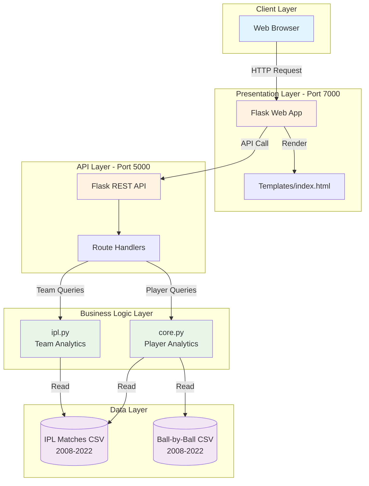
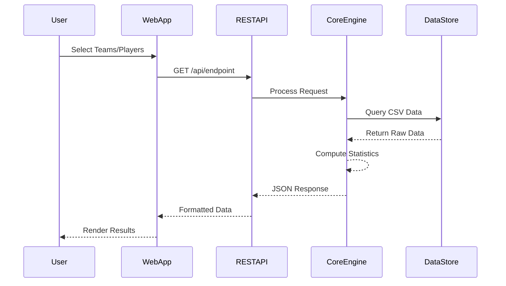
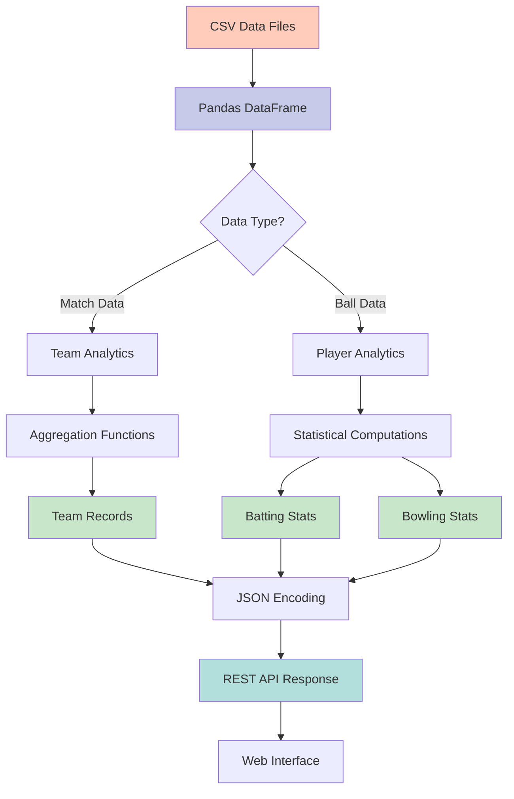

# 🏏 IPL Analytics Platform

[](https://www.python.org/)
[](https://flask.palletsprojects.com/)
[](https://pandas.pydata.org/)
[](LICENSE)

A comprehensive Indian Premier League (IPL) statistics and analytics platform built with Flask, providing detailed insights into team performances, player statistics, and head-to-head records from 2008-2022.

## 📋 Table of Contents

- [Overview](#overview)
- [Features](#features)
- [Architecture](#architecture)
- [System Design](#system-design)
- [Installation](#installation)
- [Usage](#usage)
- [API Endpoints](#api-endpoints)
- [Data Models](#data-models)
- [Technologies](#technologies)
- [Project Structure](#project-structure)
- [Screenshots](#screenshots)
- [Contributing](#contributing)
- [License](#license)

## 🎯 Overview

The IPL Analytics Platform is a full-stack web application that provides comprehensive statistical analysis of IPL matches from 2008 to 2022. The platform offers a REST API service for data retrieval and a user-friendly web interface for interactive data exploration.

### Key Highlights

- **15 years** of IPL data (2008-2022)
- **1000+** matches analyzed
- **500+** players tracked
- **Real-time** statistical computations
- **RESTful API** architecture

## ✨ Features

### 🏆 Team Analytics
- Head-to-head team comparisons
- Win/loss records
- Tournament titles and finals data
- Team performance across seasons
- Historical match statistics

### 🏏 Batting Statistics
- Comprehensive batting records
- Runs, averages, and strike rates
- Boundaries analysis (4s and 6s)
- Milestone tracking (50s and 100s)
- Player of the Match awards
- Team-specific batting performance

### ⚡ Bowling Statistics
- Detailed bowling figures
- Wickets, economy, and averages
- Best bowling performances
- 3+ wicket hauls
- Player of the Match awards
- Team-specific bowling analysis

### 📊 Interactive Web Interface
- Dropdown-based team selection
- Player search functionality
- Real-time data visualization
- Clean and intuitive UI
- Responsive design

## 🏗️ Architecture



## 🔄 System Design

### Data Flow Architecture



### Data Processing Pipeline



## 🚀 Installation

### Prerequisites

- Python 3.8 or higher
- pip (Python package manager)
- Git

### Clone the Repository

```bash
git clone https://github.com/yourusername/ipl-analytics-platform.git
cd ipl-analytics-platform
```

### Install Dependencies

```bash
pip install flask pandas numpy requests
```

### Required Python Packages

```
flask>=2.0.0
pandas>=1.3.0
numpy>=1.21.0
requests>=2.26.0
```

### Dataset Setup

Place the following CSV files in the project root:

1. `IPL_Matches_2008_2022_IPL_Matches_2008_2022.csv`
2. `IPL_Ball_by_Ball_2008_2022_IPL_Ball_by_Ball_2008_2022.csv`

## 🎮 Usage

### Starting the Application

#### Step 1: Start the REST API Service

```bash
cd surajakhuli-ipl-apiservice
python app.py
```

The API service will start on `http://127.0.0.1:5000`

#### Step 2: Start the Web Application

Open a new terminal:

```bash
cd surajakhuli-ipl-webapp
python app.py
```

The web interface will be available at `http://127.0.0.1:7000`

### Accessing the Platform

1. Open your browser and navigate to `http://localhost:7000`
2. Use the dropdown menus to select teams or players
3. Click the respective buttons to view statistics

## 📡 API Endpoints

### Base URL
```
http://127.0.0.1:5000
```

### Endpoints Overview

| Endpoint | Method | Description | Parameters |
|----------|--------|-------------|------------|
| `/api/teams` | GET | Get all IPL teams | None |
| `/api/teamvteam` | GET | Head-to-head comparison | `team1`, `team2` |
| `/api/team-record` | GET | Complete team statistics | `team` |
| `/api/batting-record` | GET | Batsman statistics | `batsman` |
| `/api/bowling-record` | GET | Bowler statistics | `bowler` |
| `/api/all-batsmen` | GET | List all batsmen | None |
| `/api/all-bowlers` | GET | List all bowlers | None |

### Sample API Calls

#### Get All Teams
```bash
curl http://127.0.0.1:5000/api/teams
```

**Response:**
```json
{
  "teams": [
    "Mumbai Indians",
    "Chennai Super Kings",
    "Royal Challengers Bangalore",
    ...
  ]
}
```

#### Team vs Team Comparison
```bash
curl "http://127.0.0.1:5000/api/teamvteam?team1=Mumbai Indians&team2=Chennai Super Kings"
```

**Response:**
```json
{
  "total_matches": "32",
  "Mumbai Indians": "19",
  "Chennai Super Kings": "13",
  "draws": "0"
}
```

#### Get Batsman Record
```bash
curl "http://127.0.0.1:5000/api/batting-record?batsman=Virat Kohli"
```

**Response:**
```json
{
  "Virat Kohli": {
    "all": {
      "innings": 207,
      "runs": 6624,
      "fours": 532,
      "sixes": 216,
      "avg": 36.73,
      "strikeRate": 129.94,
      "fifties": 45,
      "hundreds": 5,
      "highestScore": "113",
      "notOut": 27,
      "mom": 18
    },
    "against": { ... }
  }
}
```

## 📊 Data Models

### Match Data Structure

```python
{
  "ID": int,                    # Unique match identifier
  "Team1": str,                 # First team name
  "Team2": str,                 # Second team name
  "WinningTeam": str,          # Match winner
  "MatchNumber": str,          # Match type (Qualifier, Final, etc.)
  "Season": int                # IPL season year
}
```

### Ball-by-Ball Data Structure

```python
{
  "ID": int,                    # Match identifier
  "batter": str,               # Batsman name
  "bowler": str,               # Bowler name
  "batsman_run": int,          # Runs scored
  "total_run": int,            # Total runs including extras
  "isWicketDelivery": int,     # Wicket indicator (0/1)
  "extra_type": str,           # Type of extra
  "BattingTeam": str,          # Batting team name
  "BowlingTeam": str           # Bowling team name
}
```

### Computed Statistics Model

#### Team Record
```python
{
  "matchesplayed": int,
  "won": int,
  "loss": int,
  "noResult": int,
  "title": int
}
```

#### Batting Record
```python
{
  "innings": int,
  "runs": int,
  "fours": int,
  "sixes": int,
  "avg": float,
  "strikeRate": float,
  "fifties": int,
  "hundreds": int,
  "highestScore": str,
  "notOut": int,
  "mom": int
}
```

#### Bowling Record
```python
{
  "innings": int,
  "wicket": int,
  "economy": float,
  "average": float,
  "strikeRate": float,
  "best_figure": str,
  "3+W": int,
  "mom": int
}
```

## 🛠️ Technologies

### Backend
- **Flask** - Web framework for API and web application
- **Pandas** - Data manipulation and analysis
- **NumPy** - Numerical computations
- **Requests** - HTTP client for inter-service communication

### Frontend
- **HTML5** - Structure and content
- **Jinja2** - Template engine for dynamic rendering
- **CSS3** - Styling (implicit in templates)

### Data Storage
- **CSV Files** - Match and ball-by-ball data
- **In-Memory Processing** - Fast data retrieval

### Architecture Pattern
- **Microservices** - Separation of API and web layers
- **RESTful API** - Standard HTTP methods and endpoints
- **MVC Pattern** - Model-View-Controller architecture

## 📁 Project Structure

```
ipl-analytics-platform/
│
├── surajakhuli-ipl-apiservice/          # REST API Service
│   ├── app.py                           # API route definitions
│   ├── core.py                          # Player analytics engine
│   ├── ipl.py                           # Team analytics engine
│   └── data/                            # CSV data files
│       ├── IPL_Matches_2008_2022.csv
│       └── IPL_Ball_by_Ball_2008_2022.csv
│
├── surajakhuli-ipl-webapp/              # Web Application
│   ├── app.py                           # Web app routes
│   └── templates/
│       └── index.html                   # Main web interface
│
├── README.md                            # Project documentation
├── requirements.txt                     # Python dependencies
└── LICENSE                              # License file
```

## 🎨 Screenshots

### Home Page
The main dashboard provides access to all analytics features with intuitive dropdown menus.


### Team vs Team Comparison
Compare head-to-head records between any two IPL teams with detailed match statistics.


### Player Statistics
View comprehensive batting and bowling records for individual players across all seasons.


## 🤝 Contributing

Contributions are welcome! Here's how you can help:

1. **Fork the repository**
2. **Create a feature branch**
   ```bash
   git checkout -b feature/AmazingFeature
   ```
3. **Commit your changes**
   ```bash
   git commit -m 'Add some AmazingFeature'
   ```
4. **Push to the branch**
   ```bash
   git push origin feature/AmazingFeature
   ```
5. **Open a Pull Request**

### Development Guidelines

- Follow PEP 8 style guide for Python code
- Add docstrings to all functions
- Include unit tests for new features
- Update documentation as needed

## 🐛 Known Issues

- API service must be started before web application
- Large datasets may cause initial load delays
- No authentication/authorization implemented

## 🔮 Future Enhancements

- [ ] Database integration (PostgreSQL/MongoDB)
- [ ] Real-time data updates
- [ ] Advanced data visualizations (charts and graphs)
- [ ] Player comparison features
- [ ] Season-wise filtering
- [ ] Export functionality (PDF/Excel)
- [ ] User authentication
- [ ] Mobile responsive design
- [ ] Docker containerization
- [ ] API rate limiting and caching

## 📄 License

This project is licensed under the MIT License - see the [LICENSE](LICENSE) file for details.

## 👨‍💻 Author

**Suraj Akhuli**

- GitHub: [@SurajAkhuli](https://github.com/SurajAkhuli)
- LinkedIn: [Suraj Akhuli](https://www.linkedin.com/in/suraj-akhuli-3b6a5a264)

## 🙏 Acknowledgments

- IPL data sourced from official cricket databases
- Flask documentation and community
- Pandas development team
- All contributors and users of this platform

## 📞 Support

For support, email surajakhuli6@gmail.com or open an issue in the GitHub repository.

---

<div align="center">

**Made with ❤️ for Cricket Analytics**

⭐ Star this repository if you found it helpful!

</div>
